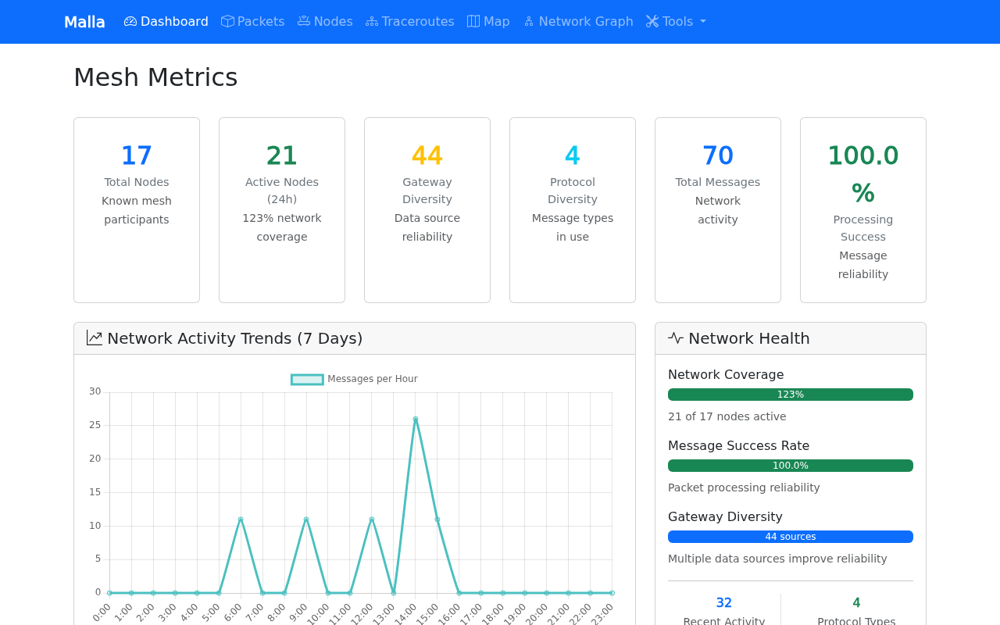
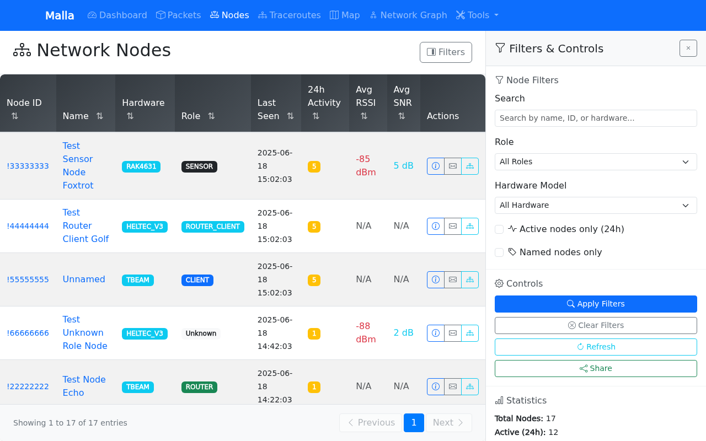
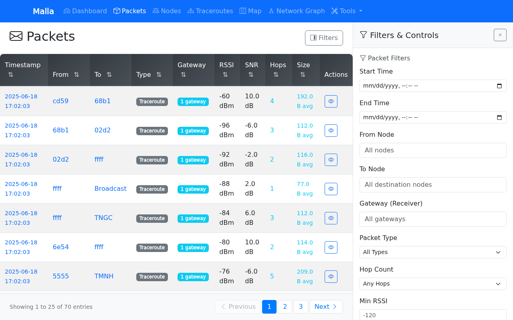
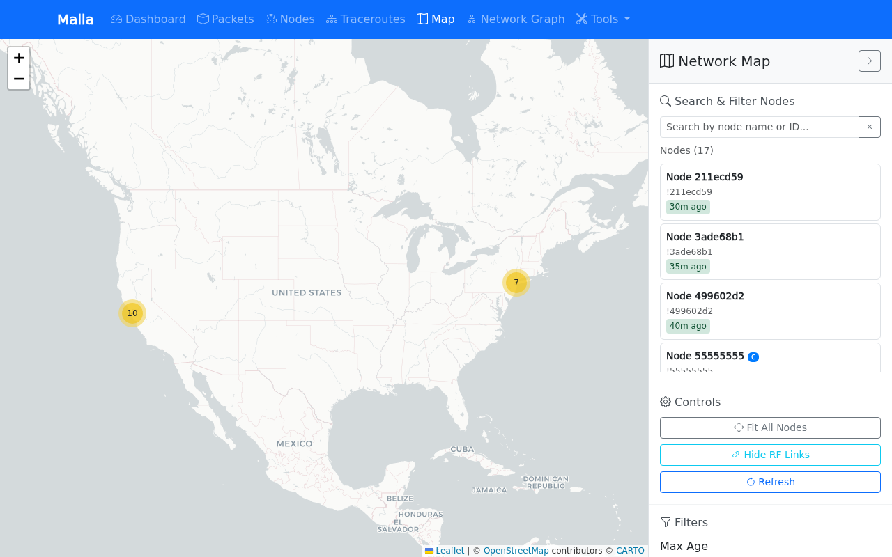
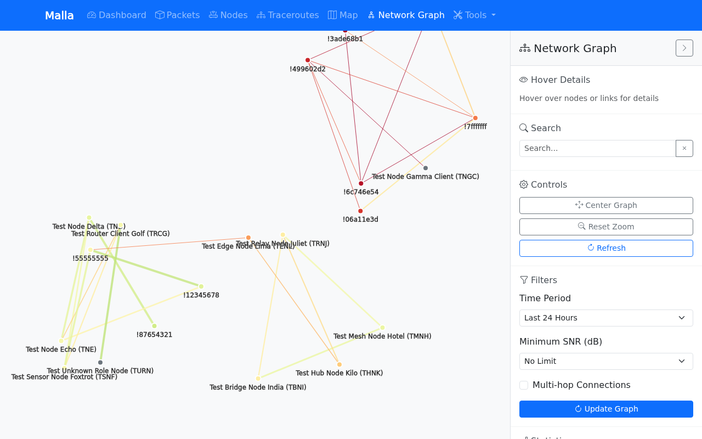

# Malla

Malla is an ([AI-built](./AI.md)) tool to log Meshtastic packets into a SQLite database and get some nice data insights from them.

## Features

### 🚀 Key Highlights

• **End-to-end capture** – Logs every packet from your Meshtastic MQTT broker straight into an optimised SQLite database.

• **Live dashboard** – Real-time counters for total / active nodes, packet rate, signal quality bars and network-health indicators (auto-refresh).

• **Packet browser** – Lightning-fast table with powerful filtering (time range, node, port, RSSI/SNR, type), pagination and one-click CSV export.

• **Node explorer** – Detailed hardware, role, battery and signal info for every node – searchable picker plus online/offline badges.

• **Traceroutes** – Historical list view to inspect packet paths across the mesh network.

• **Map view** – Leaflet map with live node locations, RF-link overlays and role colour-coding.

• **Network graph** – Force-directed graph visualising multi-hop links and RF distances between nodes / gateways.

• **Toolbox** – Hop-analysis tables, gateway-compare matrix and "longest links" explorer for deep dives.

• **Analytics charts** – 7-day trends, RSSI distribution, top talkers, hop distribution and more (Plotly powered).

• **Single-source config** – One `config.yaml` (or `MALLA_*` env-vars) drives both the capture tool and the web UI.

• **One-command launch** – `malla-capture` and `malla-web` wrapper scripts get you up and running in seconds.

<!-- screenshots:start -->





<!-- screenshots:end -->

## Prerequisites

- Python 3.13+
- Access to a Meshtastic MQTT broker
- Modern web browser with JavaScript enabled

## Installation

1. **Clone or download** the project files to your preferred directory

2. **Install dependencies**:
   ```bash
   # The recommended way: install uv if you haven't already
   curl -LsSf https://astral.sh/uv/install.sh | sh

   # Install project dependencies
   uv sync
   ```

   Or using pip:
   ```bash
   pip install -r requirements.txt
   ```

3. **Optional: Install as a package** (enables command-line scripts):
   ```bash
   # Install in development mode with uv
   uv pip install -e .

   # Or with pip
   pip install -e .
   ```

   After installation, you can use the convenient command-line scripts:
   ```bash
   # Start the web UI
   malla-web

   # Start the MQTT capture tool
   malla-capture
   ```

## Quick Start

The system consists of two components that work together:

### 1. MQTT Data Capture

This tool connects to your Meshtastic MQTT broker and captures all mesh packets to a SQLite database.

**Configuration:**
```bash
# Set your MQTT broker address (required)
export MALLA_MQTT_BROKER_ADDRESS="your.mqtt.broker.address"

# Optional: Set MQTT credentials if needed
export MALLA_MQTT_USERNAME="your_username"
export MALLA_MQTT_PASSWORD="your_password"

# Optional: Customize database location
export MALLA_DATABASE_FILE="meshtastic_history.db"
```

**Start the capture tool:**
```bash
# Method 1: Using the wrapper script (recommended)
./malla-capture

# Method 2: Using uv to run the module
uv run python -m malla.mqtt_capture

# Method 3: Using the standalone script
uv run python mqtt_to_sqlite.py

# Method 4: If installed as package
malla-capture
```

### 2. Web UI

The web interface for browsing and analyzing the captured data.

**Start the web UI:**
```bash
# Method 1: Using the wrapper script (recommended)
./malla-web

# Method 2: Using uv to run the module
uv run python -m malla.web_ui

# Method 3: Using regular Python with the module
python -m malla.web_ui

# Method 4: If installed as package
malla-web
```

**Access the web interface:**
- Local: http://localhost:5008
- Network: http://your-server-ip:5008

## Running Both Tools Together

For a complete monitoring setup, run both tools simultaneously:

**Terminal 1 - Data Capture:**
```bash
export MALLA_MQTT_BROKER_ADDRESS="127.0.0.1"  # Replace with your broker
./malla-capture
```

**Terminal 2 - Web UI:**
```bash
./malla-web
```

Both tools can safely access the same SQLite database concurrently using thread-safe connections.

## Configuration Options

### YAML configuration file *(recommended)*

Malla will automatically look for a file named `config.yaml` in the **current
working directory** when it starts.  You can point to an alternative file by
setting the `MALLA_CONFIG_FILE` environment variable.

If the file is not found, all built-in defaults are used (see
`config.sample.yaml`).

Copy the sample file and customise it:

```bash
cp config.sample.yaml config.yaml
$EDITOR config.yaml  # tweak values as required
```

The file is **git-ignored** so you will never accidentally commit secrets such
as your `secret_key`.

The following keys are recognised:

| YAML key        | Type   | Default                                  | Description                                   | Env-var override |
| --------------- | ------ | ---------------------------------------- | --------------------------------------------- | ---------------- |
| `name`          | str    | `"Malla"`                                | Display name shown in the navigation bar.     | `MALLA_NAME` |
| `home_markdown` | str    | `""`                                     | Markdown rendered on the dashboard homepage.  | `MALLA_HOME_MARKDOWN` |
| `secret_key`    | str    | `"dev-secret-key-change-in-production"` | Flask session secret key (change in prod!).   | `MALLA_SECRET_KEY` |
| `database_file` | str    | `"meshtastic_history.db"`                | SQLite database file location.                | `MALLA_DATABASE_FILE` |
| `host`          | str    | `"0.0.0.0"`                              | Interface to bind the web server to.          | `MALLA_HOST` |
| `port`          | int    | `5008`                                   | TCP port for the web server.                  | `MALLA_PORT` |
| `debug`         | bool   | `false`                                  | Run Flask in debug mode (unsafe for prod!).   | `MALLA_DEBUG` |

Environment variables **always override** values coming from the YAML file.

### Environment Variable Overrides (optional)

**MQTT Capture Tool:**
- `MALLA_MQTT_BROKER_ADDRESS`: MQTT broker hostname/IP (required)
- `MALLA_MQTT_PORT`: MQTT broker port (default: 1883)
- `MALLA_MQTT_USERNAME`: MQTT username (optional)
- `MALLA_MQTT_PASSWORD`: MQTT password (optional)
- `MALLA_MQTT_TOPIC_PREFIX`: Topic prefix (default: "msh")
- `MALLA_MQTT_TOPIC_SUFFIX`: Topic suffix (default: "/+/+/+/#")
- `MALLA_DATABASE_FILE`: SQLite database path (default: "meshtastic_history.db")
- `MALLA_LOG_LEVEL`: Logging level (default: "INFO")

**Web UI:** You can still override individual settings without a YAML file via
environment variables with the same names from the table above (e.g.
`MALLA_PORT=8080`).

> **Note** Older variable names such as `FLASK_PORT` or `DATABASE_FILE` are no
> longer recognised – use the `MALLA_*` prefix instead.

### Custom Configuration Example

```bash
# Custom setup with different database and ports
export MALLA_MQTT_BROKER_ADDRESS="mqtt.example.com"
export MALLA_MQTT_USERNAME="meshtastic_user"
export MALLA_MQTT_PASSWORD="secure_password"
export MALLA_DATABASE_FILE="/data/mesh_network.db"
export MALLA_PORT="8080"

# Start capture tool
./malla-capture &

# Start web UI
./malla-web
```

### Debug Mode

**MQTT Capture Tool:**
```bash
export LOG_LEVEL="DEBUG"
uv run python mqtt_to_sqlite.py
```

**Web UI:**
```bash
export FLASK_DEBUG="true"
uv run python main.py
```

## Development

### Using uv for Development

```bash
# Install development dependencies
uv sync --dev

# Run tests
uv run pytest

# Run with specific Python version
uv run --python 3.13 python -m malla.mqtt_capture
```

## Security Considerations

- **Local use recommended**: Bind to `127.0.0.1` for local access only
- **Network access**: If exposing on network, consider reverse proxy with authentication
- **Database access**: Ensure database file permissions are appropriately restricted
- **No authentication**: This tool has no built-in authentication - secure at network level if needed

## Contributing

Feel free to submit issues, feature requests, or pull requests to improve Malla!

## License

This project is licensed under the [MIT](LICENSE) license.
