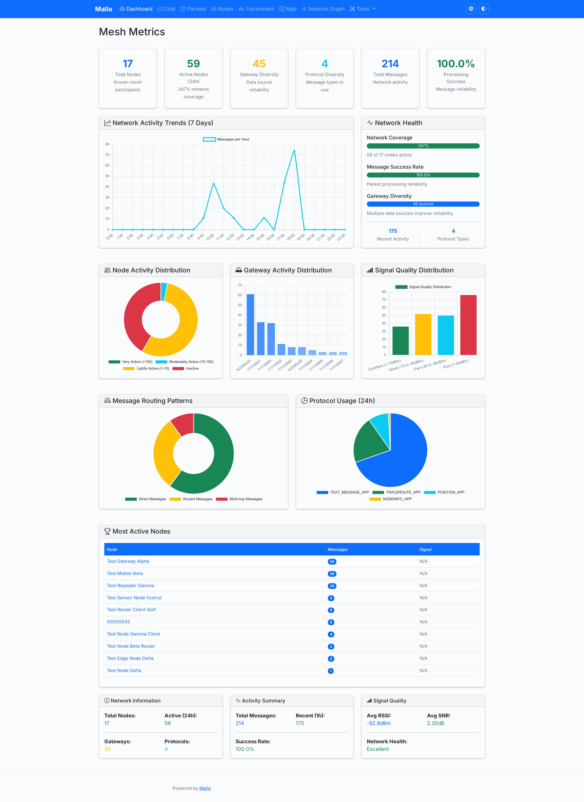
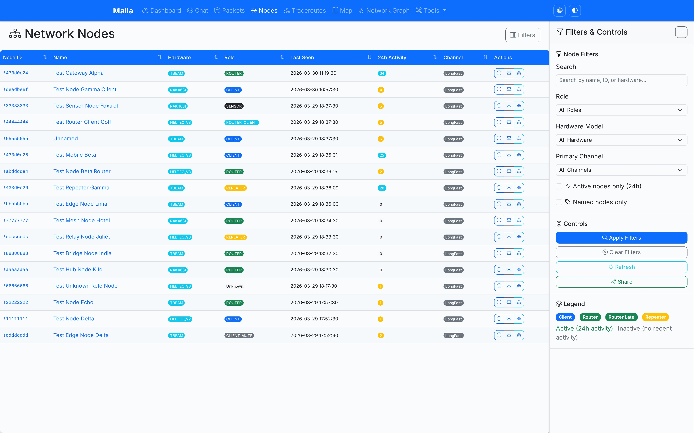
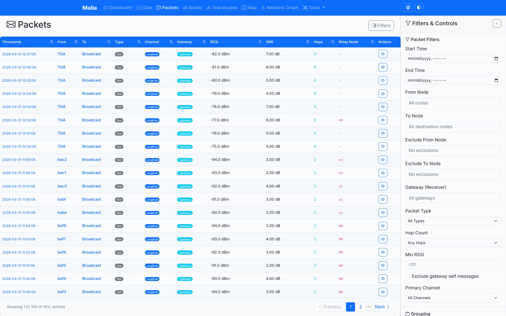
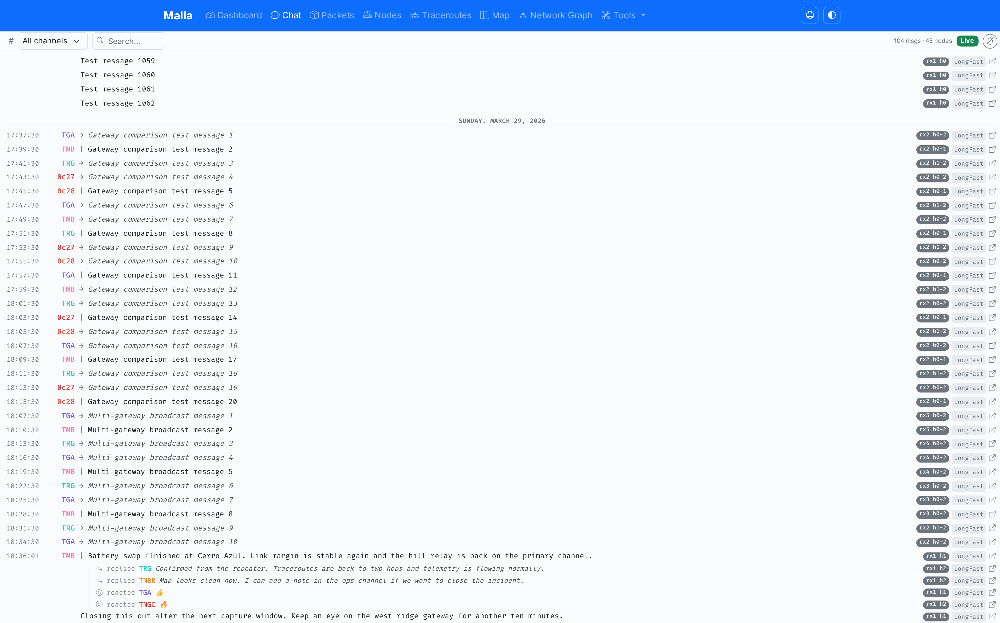
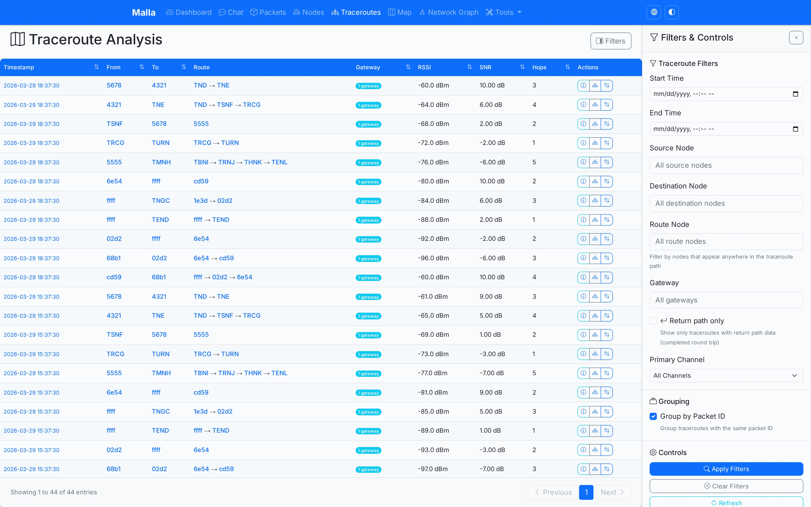
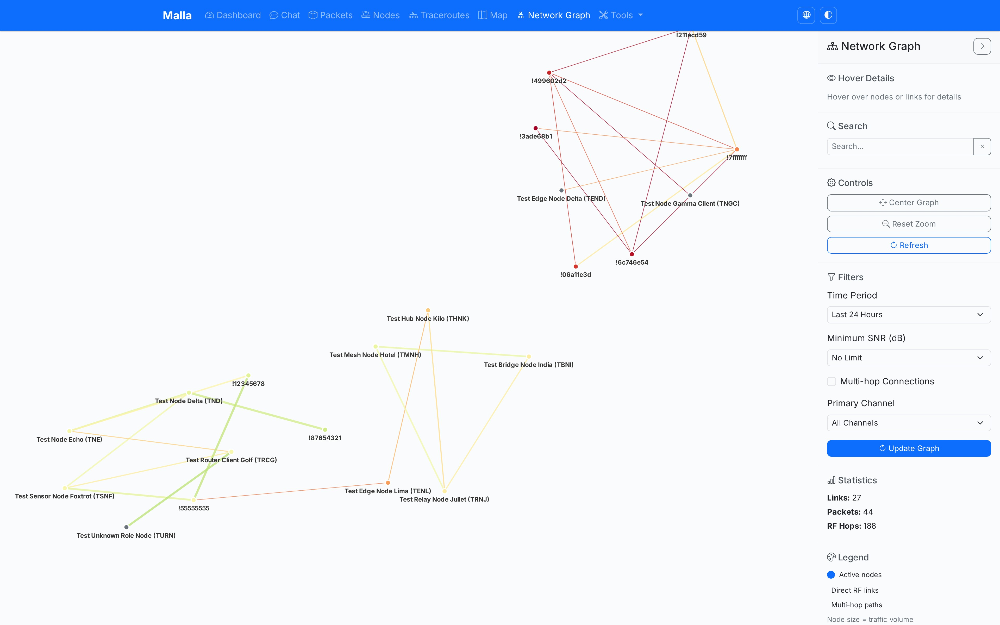
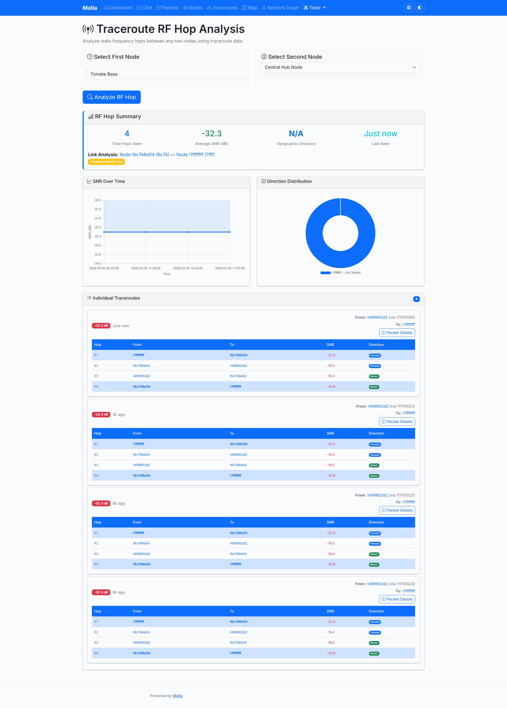
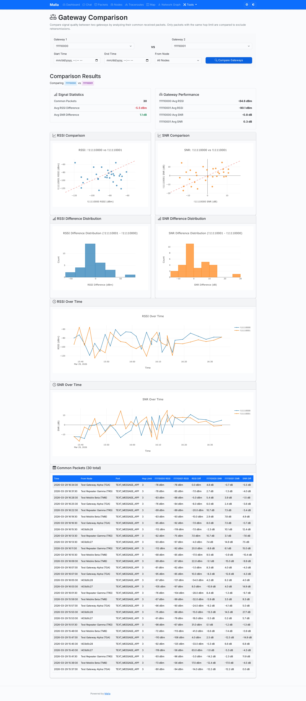
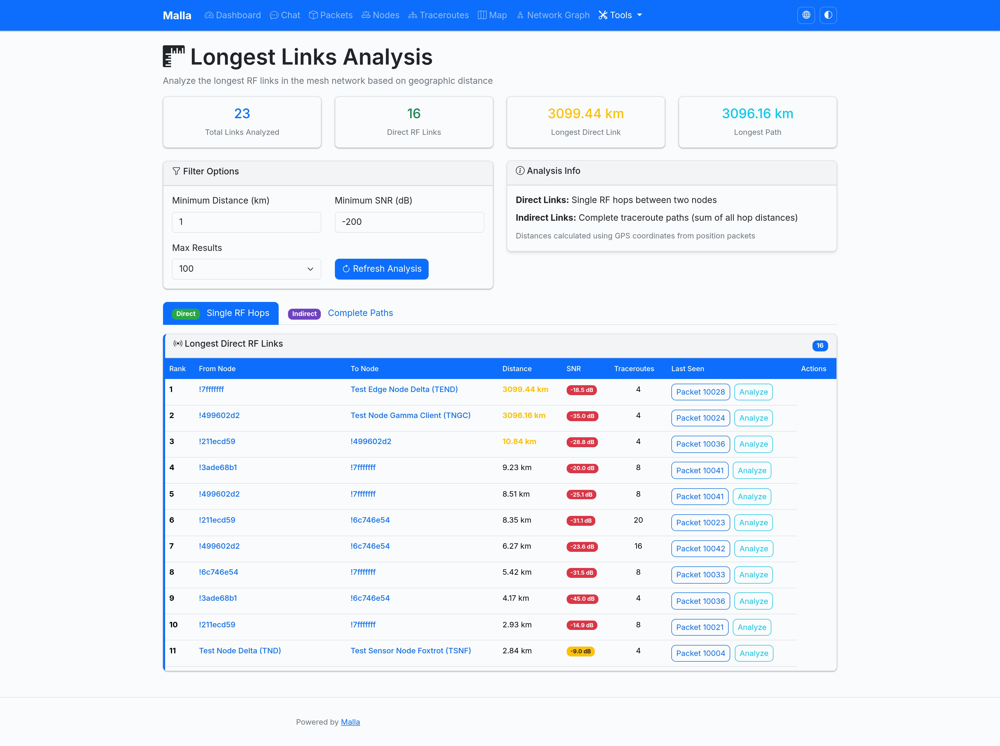

# Malla (Meshworks fork)

Malla (_Mesh_, in Spanish) is an ([AI-built](./AI.md)) tool that logs Meshtastic packets from an MQTT broker into a SQLite database and exposes a web UI to explore and monitor the network.  
This repository is Meshworks' maintained fork of [zenitraM/malla](https://github.com/zenitraM/malla) and powers the monitoring stack behind [meshworks.ru](https://meshworks.ru/).

> **Heads-up:** we do **not** publish container images for this fork.  
> Build the Docker image locally (instructions below) before running with Docker Compose.

## Quick start

Pick whichever workflow fits you best:

- **Local development (recommended)**  
  ```bash
  git clone https://git.meshworks.ru/MeshWorks/meshworks-malla.git
  cd meshworks-malla
  curl -LsSf https://astral.sh/uv/install.sh | sh        # install uv (once)
  uv sync --dev                                         # install deps incl. Playwright tooling
  playwright install chromium --with-deps              # e2e/browser support (once per host)
  cp config.sample.yaml config.yaml                    # adjust broker settings
  uv run malla-capture                                  # terminal 1 – capture
  uv run malla-web                                      # terminal 2 – web UI
  ```

- **Docker compose (deployment-style)**  
  ```bash
  git clone https://git.meshworks.ru/MeshWorks/meshworks-malla.git
  cd meshworks-malla
  cp env.example .env                                  # fill in MQTT credentials
  docker build -t meshworks/malla:local .
  export MALLA_IMAGE=meshworks/malla:local
  docker compose up -d
  ```
  `malla-capture` and `malla-web` share the volume `malla_data`, so captured history persists across restarts.

Need demo data, screenshots, or detailed dev docs? See [docs/development.md](docs/development.md).

## Running instances

Meshworks operates a public deployment backed by this fork:
- https://malla.meshworks.ru/ (Russia / Moscow mesh)

Community-operated upstream instances such as https://malla.meshtastic.es/ may run different code; feature parity is not guaranteed.

## Meshworks-specific enhancements

In addition to staying close to upstream, this fork ships Meshworks-focused improvements:

- Hardened chat experience with filterable live stream, adaptive tooltips and extensive end-to-end tests.
- Dark-mode aligned UI assets and Playwright-based screenshot tooling (`scripts/generate_screenshots.py`).
- Deterministic demo database generator for docs/tests via `scripts/create_demo_database.py`.
- Continuous integration coverage for Python 3.13 + Playwright, matching our production stack.
- Infrastructure docs and GitOps alignment for the Meshworks Meshtastic deployment.

Wherever possible we keep changes compatible so upstream updates remain easy to merge.

## Features

### 🚀 Key Highlights

- **Capture & storage** – every MQTT packet lands in an optimized SQLite history.
- **Dashboard** – live counters, health indicators and auto-refresh cards.
- **Packets browser** – fast filters (time, node, RSSI/SNR, type) with CSV export.
- **Chat page** – rich `TEXT_MESSAGE_APP` stream with sender/channel filters.
- **Node explorer** – full hardware/role/battery view with search & status badges.
- **Traceroutes / map / network graph** – visualize paths, geography and topology.
- **Toolbox** – hop analysis, gateway comparison, longest links and more.
- **Analytics** – 7‑day trends, RSSI distribution, top talkers and hop stats.
- **Single config** – `config.yaml` (or `MALLA_*` env vars) drives both services.
- **One-command launch** – `malla-capture` + `malla-web` wrappers for quick starts.

<!-- screenshots:start -->










<!-- screenshots:end -->

## Repository layout

- `src/malla/web_ui.py` – Flask app factory, template filters and entrypoints.
- `src/malla/routes/` – HTTP routes (`main_routes.py` for UI pages, `api_routes.py` for JSON endpoints).
- `src/malla/database/` – connection helpers and repositories (includes the chat data access layer).
- `src/malla/templates/` – Jinja2 templates; `chat.html` contains the new chat interface.
- `src/malla/static/` – CSS/JS assets tailored for the Meshworks fork.
- `scripts/` – local tooling (`create_demo_database.py`, `generate_screenshots.py`).
- `tests/` – unit, integration and Playwright e2e suites.
- `.screenshots/` – auto-generated images embedded in this README.

## Prerequisites

- Python 3.13+ (when running locally with `uv`)
- Docker 24+ (if you prefer containers)
- Access to a Meshtastic MQTT broker
- Modern web browser with JavaScript enabled

## Installation

### Using Docker (build locally)

There is no public container image for this fork. Build it locally and point Docker Compose at the result.

```bash
git clone https://git.meshworks.ru/MeshWorks/meshworks-malla.git
cd meshworks-malla
cp env.example .env                      # fill in MQTT credentials
$EDITOR .env
docker build -t meshworks/malla:local .  # add --platform for multi-arch
export MALLA_IMAGE=meshworks/malla:local
docker compose up -d
docker compose logs -f                   # watch containers
```
The compose file ships with a capture + web pair already wired to share `malla_data` volume.

**Manual Docker run (advanced):**
```bash
# Shared volume for the SQLite database
docker volume create malla_data

# Capture worker
docker run -d --name malla-capture \
  -e MALLA_MQTT_BROKER_ADDRESS=your.mqtt.broker.address \
  -e MALLA_DATABASE_FILE=/app/data/meshtastic_history.db \
  -v malla_data:/app/data \
  meshworks/malla:local \
  /app/.venv/bin/malla-capture

# Web UI
docker run -d --name malla-web \
  -p 5008:5008 \
  -e MALLA_DATABASE_FILE=/app/data/meshtastic_history.db \
  -e MALLA_HOST=0.0.0.0 \
  -e MALLA_PORT=5008 \
  -v malla_data:/app/data \
  meshworks/malla:local \
  /app/.venv/bin/malla-web
```

### Using uv

You can also install and run this fork directly using [uv](https://docs.astral.sh/uv/):
1. **Clone the repository** (Meshworks fork):
   ```bash
   git clone https://git.meshworks.ru/MeshWorks/meshworks-malla.git
   cd meshworks-malla
   ```

2. **Install uv** if you do not have it yet:
   ```bash
   curl -LsSf https://astral.sh/uv/install.sh | sh
   ```

3. **Create a configuration file** by copying the sample file:
   ```bash
   cp config.sample.yaml config.yaml
   $EDITOR config.yaml  # tweak values as desired
   ```

4. **Install dependencies** (development extras recommended):
   ```bash
   uv sync --dev
   playwright install chromium --with-deps
   ```

5. **Start it** with `uv run` in the project directory, which pulls the required dependencies automatically.
   ```bash
   # Start the web UI
   uv run malla-web

   # Start the MQTT capture tool
   uv run malla-capture
   ```

### Using Nix
The project also comes with a Nix flake and a devshell - if you have Nix installed or run NixOS it will set up
`uv` for you together with the exact system dependencies that run on CI (Playwright, etc.):

```bash
nix develop --command uv run malla-web
nix develop --command uv run malla-capture
```

## Core components overview

The system consists of two components that work together:

### 1. MQTT Data Capture

This tool connects to your Meshtastic MQTT broker and captures all mesh packets to a SQLite database. You will need to configure the MQTT broker address in the `config.yaml` file (or set the `MALLA_MQTT_BROKER_ADDRESS` environment variable) before starting it. See [Configuration Options](#configuration-options) for the entire set of settings.

```yaml
mqtt_broker_address: "your.mqtt.broker.address"
```

You can use this tool with your own MQTT broker that you've got your own nodes connected to, or with a public broker if you've got permission to do so.

**Start the capture tool:**
```bash
uv run malla-capture
```

### 2. Web UI

The web interface for browsing and analyzing the captured data.

**Start the web UI:**
```bash
uv run malla-web
```

**Access the web interface:**
- Local: http://localhost:5008

## Running Both Tools Together

For a complete monitoring setup, run both tools simultaneously:

**Terminal 1 – capture:**
```bash
uv run malla-capture
# or, after `uv sync`, use the helper script:
./malla-capture
```

**Terminal 2 – web UI:**
```bash
uv run malla-web
# or:
./malla-web
```

Both commands read the same SQLite database and cooperate safely thanks to the repository connection pool.

## Further reading

- [Development guide](docs/development.md) – demo database tooling, detailed testing matrix, Docker production tips, configuration reference and the full pre-push checklist.
## Contributing

Feel free to submit issues, feature requests, or pull requests to improve Malla!

## License

This project is licensed under the [MIT](LICENSE) license.
